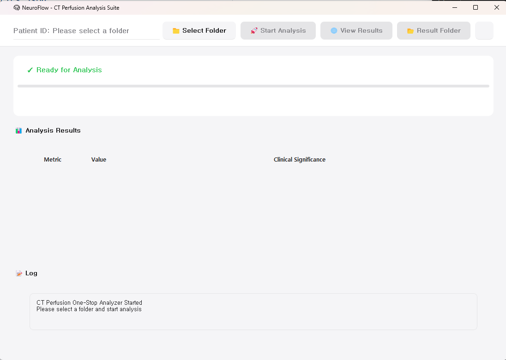
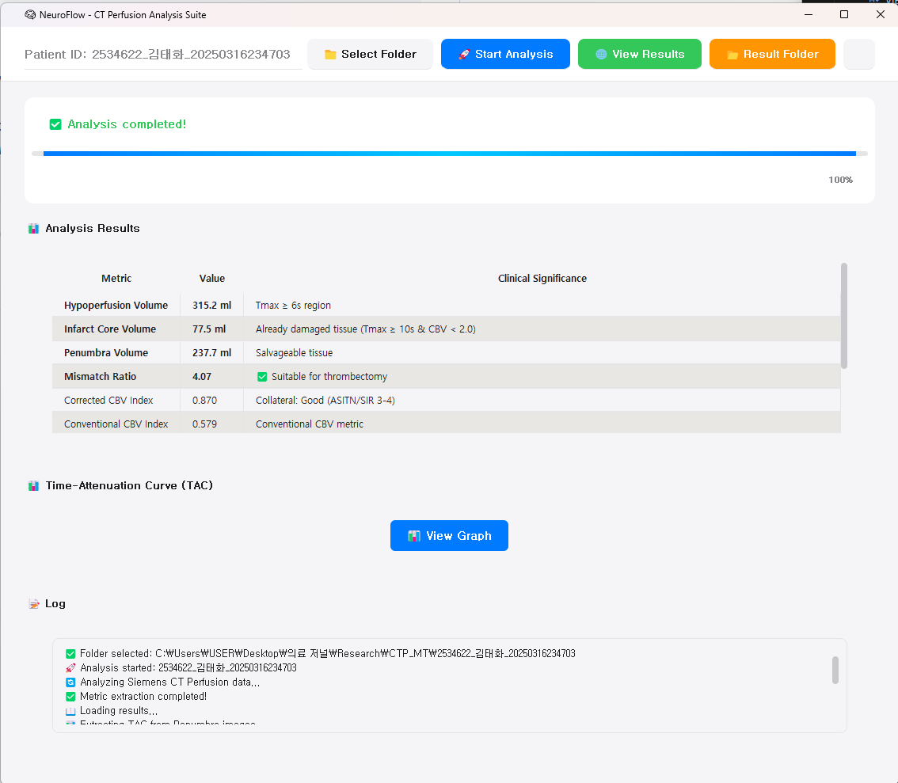
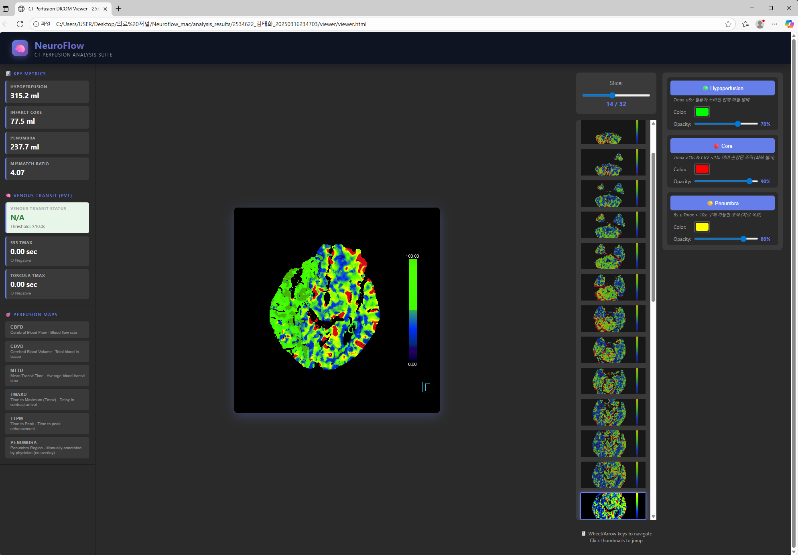

# 🧠 NeuroFlow: CT Perfusion Auto-Analysis (Open Source)

**Python-based Automated CT Perfusion Analysis GUI Tool**

Automatically generates key perfusion metrics and interactive web viewer from DICOM folders.

[](https://www.python.org/)
[](https://pypi.org/project/PyQt5/)
[](LICENSE)
[](https://github.com/JoonHaJang/ct-perfusion-auto)

---

## 🎯 Key Features

### ✨ Highlights
- 🚀 **One-Click Analysis**: Select DICOM folder → Auto analysis → View results
- 📊 **Automatic Clinical Metrics**: Hypoperfusion, Core, Penumbra, Mismatch Ratio, etc.
- 🎨 **Interactive Web Viewer**: View all perfusion maps in browser
- 🔬 **Validated Accuracy**: RGB → Scalar conversion accuracy 100% (MAE=0.0)
- 💻 **Cross-Platform**: Windows, Mac, Linux support

### 📈 Calculated Metrics
| Metric | Description | Clinical Significance |
|--------|-------------|----------------------|
| **Hypoperfusion Volume** | Tmax >6s region | Total ischemic area |
| **Infarct Core Volume** | CBF <38% (relative) | Already damaged tissue (irreversible) |
| **Penumbra Volume** | Hypoperfusion - Core | Salvageable tissue (treatment target) |
| **Mismatch Ratio** | Hypoperfusion / Core | Thrombectomy indication |
| **Corrected CBV Index** | CBV(lesion) / CBV(contralateral) | Delay-corrected CBV ratio |
| **Conventional CBV Index** | Lesion CBV / Contralateral CBV | Traditional CBV metric |

---

## 🚀 Quick Start

### 1. Installation

```bash
# Clone repository
git clone https://github.com/JoonHaJang/ct-perfusion-auto.git
cd ct-perfusion-auto

# Install packages
pip install -r requirements.txt
```

⚠️ **Requirements**: Python 3.8 or higher

**requirements.txt**:
```txt
PyQt5>=5.15.0          # GUI framework
pydicom>=2.3.0         # DICOM file reading
numpy>=1.21.0,<2.0     # Numerical computation
Pillow>=9.0.0          # Image conversion
scipy>=1.7.0           # Contour detection
nibabel>=3.2.0         # NIfTI file saving
```

### 2. Run

#### **Windows Users**

```bash
python ct_perfusion_viewer_windows.py
```

#### **Mac Users**

```bash
python ct_perfusion_viewer_mac.py
```

---

## 🖥️ GUI Usage Guide

### 1️⃣ Program Launch



**Main Features:**
- 📁 **Select Folder**: Choose DICOM folder
- 🚀 **Start Analysis**: Begin automatic analysis
- 🌐 **View Results**: Open web viewer
- 📂 **Result Folder**: Open results folder

**Status Display:**
- ✅ Ready for Analysis: Ready to analyze
- 📊 Analysis Results: Results table (empty initially)
- 📝 Log: Real-time progress

---

### 2️⃣ Analysis Complete Screen



**Analysis Results Table:**

| Metric | Value | Clinical Significance |
|--------|-------|----------------------|
| **Hypoperfusion Volume** | 315.2 ml | Tmax ≥ 6s region |
| **Infarct Core Volume** | 77.5 ml | Already damaged tissue |
| **Penumbra Volume** | 237.7 ml | Salvageable tissue |
| **Mismatch Ratio** | 4.07 | ✅ Suitable for thrombectomy |
| **Corrected CBV Index** | 0.870 | Good collateral circulation |
| **Conventional CBV Index** | 0.579 | Traditional CBV metric |

**Additional Features:**
- 📈 **View Graph**: View TAC (Time-Attenuation Curve) graph
- 📝 **Log**: Detailed analysis progress log

---

### 3️⃣ Interactive Web Viewer



**Web Viewer Features:**

**Left Panel - Key Metrics:**
- Hypoperfusion: 315.2 ml
- Infarct Core: 77.5 ml
- Penumbra: 237.7 ml
- Mismatch Ratio: 4.07
- Corrected CBV Index: 0.870

**Center - Perfusion Maps:**
- 🎨 Color-mapped brain images
- 🖱️ Mouse wheel to navigate slices
- 🔍 Zoom in/out

**Right Panel - Slice Navigation:**
- 📸 All slice thumbnails
- 🎯 Current slice highlight
- Quick slice selection

**Overlay Toggle:**
- 🟢 Hypoperfusion (Tmax >6s)
- 🔴 Core (damaged tissue)
- 🟡 Penumbra (salvageable tissue)

**Perfusion Map Types:**
- CBFD (Cerebral Blood Flow)
- CBVD (Cerebral Blood Volume)
- MTTD (Mean Transit Time)
- TMAXD (Time to Maximum)
- TTPM (Time to Peak)
- PENUMBRA (Penumbra region)

---

## 📁 Project Structure

### **Core Files**
```
ct-perfusion-auto/
│
├── ct_perfusion_viewer_windows.py      ← Windows GUI ⭐
├── ct_perfusion_viewer_mac.py          ← Mac GUI ⭐
├── requirements.txt                    ← Python dependencies
│
└── scripts/
    ├── extract_metrics_from_dicom.py   ← Perfusion metrics calculation
    ├── generate_dicom_viewer.py        ← HTML web viewer generation
    ├── extract_tac_from_penumbra.py    ← TAC extraction
    └── [Other analysis scripts]
```

---

## 🧠 Clinical Significance

### Understanding Penumbra

```
┌─────────────────────────────────────────┐
│  Tissue Status in Acute Stroke          │
├─────────────────────────────────────────┤
│                                          │
│  ⬛ Core (Infarct Core)                 │
│     - Already dead tissue                │
│     - Irreversible damage                │
│     - CBF < 38% (relative)               │
│                                          │
│  🔵 Penumbra                             │
│     - At risk but still viable           │
│     - Salvageable with treatment!        │
│     - Tmax >6s & CBF ≥38%                │
│                                          │
│  ⚫ Tmax >6s (Total Hypoperfusion)       │
│     - Core + Penumbra                    │
│     - Delayed blood flow region          │
│                                          │
└─────────────────────────────────────────┘
```

### Mismatch Ratio

```
Mismatch Ratio = Hypoperfusion / Core

> 1.8: Thrombectomy indication (DEFUSE3, DAWN criteria)
> 2.6: High salvageability
< 1.2: Limited salvageable tissue
```

### CBV Index (Corrected)

```
CBV Index = CBV(Tmax >6s region) / CBV(contralateral normal)

> 0.7: Good collateral circulation
< 0.4: Poor collateral (poor prognosis)
```

---

## 👨‍⚕️ Authors & Contact

**Developers:**  
- Hae-Kwan Park* (parkoct@catholic.ac.kr)
- HyukJang1 (ceraf100@gmail.com)
- JoonHaJang (cyber040946@gmail.com)

*Corresponding author

---

## 📖 Citation

If you use this code or reproduce the analysis, please cite:

**Paper:**
```
Jang H, Jang J, Jang D-K, Sung J-H, Lee H-J, Park H-K. 
Validation of a CTP-Derived Corrected CBV Index as a Surrogate of 
DSA-Based ASITN/SIR Collateral in Anterior Circulation Ischemia. 
2025. DOI: (TBD)
```

**Repository:**
```
Park HK & Jang H. CT Perfusion Auto-Analysis Pipeline (open-source). 
https://github.com/JoonHaJang/ct-perfusion-auto
```

---

## 📄 License

**MIT License** — Free for academic and clinical research use.

For commercial use, please contact the corresponding author (parkoct@catholic.ac.kr).

---

## 🙏 Acknowledgments

- Neurosurgeons for clinical feedback
- DICOM standard and open-source community
- PyQt5, pydicom, numpy developers

---

**⭐ If this project helps you, please give it a star!**
